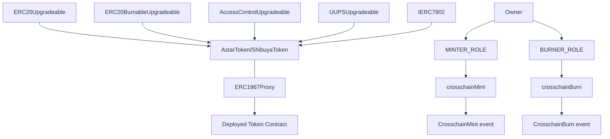

# Chainlink CCIP ERC7802 Token Bridge

This repository demonstrates the implementation of the [ERC7802 standard](https://eips.ethereum.org/EIPS/eip-7802) for cross-chain token transfers using Chainlink's Cross-Chain Interoperability Protocol (CCIP).

## Overview

This project showcases how to create and deploy upgradeable ERC20 tokens that implement the ERC7802 interface, along with the necessary token pool contracts to facilitate cross-chain transfers using Chainlink CCIP.

### Deployed Tokens

The tokens have been deployed to the following addresses:

- **ShibuyaToken (SBY)**: [0x3c1F7c5f4C560afFCFe2b5ebF1271c3310867ff4](https://soneium-minato.blockscout.com/address/0x3c1F7c5f4C560afFCFe2b5ebF1271c3310867ff4) on Soneium Minato
- **AstarToken (ASTR)**: [0x2CAE934a1e84F693fbb78CA5ED3B0A6893259441](https://soneium.blockscout.com/token/0x2CAE934a1e84F693fbb78CA5ED3B0A6893259441) on Soneium

## What is ERC7802?

[ERC7802](https://eips.ethereum.org/EIPS/eip-7802) is an Ethereum Improvement Proposal that standardizes cross-chain ERC20 token transfers. This standard defines a consistent interface for tokens that can be transferred across different blockchain networks.

### Key Components

- **crosschainMint**: Function that mints tokens when they arrive from another chain
- **crosschainBurn**: Function that burns tokens when they are sent to another chain
- **Events**: StandardizedCrosschainMint and StandardizedCrosschainBurn events that emit when tokens move across chains

### Benefits

- **Standardization**: Creates a unified interface for cross-chain token bridges
- **Transparency**: Provides clear events for tracking cross-chain movements
- **Compatibility**: Works with existing token standards like ERC20
- **Interoperability**: Enables seamless integration with various cross-chain communication protocols

By implementing ERC7802, tokens can be bridged between different blockchains in a standardized way, improving the interoperability of the blockchain ecosystem.

## ERC7802 Ecosystem Adoption

### OP Superchain Implementation

The [Optimism Superchain](https://docs.optimism.io/interop/superchain-erc20) has adopted ERC7802 as their standard for cross-chain token transfers through their `SuperchainERC20` implementation. This provides a practical example of how ERC7802 is being used in major blockchain ecosystems.

Key aspects of the Optimism implementation:

- **Asset Teleportation**: Instead of wrapping assets, tokens are "teleported" between chains through burn/mint mechanics, providing a secure and capital-efficient method for cross-chain transactions.
- **Infrastructure Simplicity**: Zero infrastructure cost to make a token cross-chain compatible.
- **Deployment Requirements**: Tokens must deploy at the same address on all chains for interoperability.
- **Permission Model**: Token contracts must grant permission to the `SuperchainTokenBridge` to call `crosschainMint` and `crosschainBurn`.

The SuperchainERC20 approach demonstrates how ERC7802 enables:
1. Consistent user experience across multiple chains
2. Elimination of liquidity fragmentation
3. Simplified cross-chain token transfers without wrapping or liquidity pools
4. Common interface across the entire EVM ecosystem

This aligns with our implementation approach using Chainlink CCIP as the cross-chain communication protocol, showing the versatility of the ERC7802 standard across different bridge solutions.

## About Chainlink CCIP

[Chainlink Cross-Chain Interoperability Protocol (CCIP)](https://chain.link/cross-chain) is a secure interoperability protocol enabling:

- Token transfers across blockchains
- Cross-chain messaging
- Building cross-chain applications
- Enabling cross-chain real-world assets
- Connecting private and public blockchains

CCIP provides defense-in-depth security and is powered by Chainlink oracle networks, which have secured tens of billions of dollars and enabled over $18 trillion in on-chain transaction value.

Key features:
- **Risk Management Network**: Actively monitors, detects, and mitigates risks in real-time
- **Cross-Chain Tokens (CCTs)**: Cross-chain-native assets secured by CCIP
- **Programmable Token Transfers**: Send tokens with instructions for their use on the destination chain
- **Arbitrary Messaging**: Transfer data between smart contracts on different blockchains

## Features

- **ERC7802 Implementation**: Support for the emerging standard for cross-chain ERC20 token transfers
- **Upgradeable Contracts**: Uses OpenZeppelin's UUPS proxy pattern for upgradeability
- **Two Pool Types**:
  - **BurnMintTokenPool**: Burns tokens on the source chain and mints them on the destination chain
  - **LockReleaseTokenPool**: Locks tokens on the source chain and releases them on the destination chain
- **Role-Based Access Control**: Fine-grained permissions for minting and burning
- **Two-Step Ownership Transfer**: Secure ownership management with transfer request and acceptance
- **Comprehensive Test Suite**: Full coverage of token functionality, upgradeability, and cross-chain operations

## Security Audit

This codebase has been audited by Cyfrin, a professional smart contract auditing firm. The audit report can be found here:

- [Cyfrin Audit Report - December 23, 2024](https://github.com/Cyfrin/cyfrin-audit-reports/blob/main/reports/2024-12-23-cyfrin-soneium-shibuya-v2.0.pdf)

The audit focused on the Shibuya token implementation and verified the security of the contract's role-based access control, cross-chain functionality, and upgradeability mechanisms.

## Prerequisites

- Node.js v16+
- pnpm (recommended) or npm
- An Ethereum wallet with testnet ETH for deployment
- Access to Chainlink CCIP supported networks

## Installation

```bash
# Clone the repository
git clone https://github.com/your-org/chainlink-ccip-erc7802.git
cd chainlink-ccip-erc7802

# Install dependencies
pnpm install
```

## Configuration

1. Set up environment variables:

```bash
# Install the environment variable encryption tool
pnpm add -D @chainlink/env-enc

# Create and encrypt your environment variables
npx env-enc set PRIVATE_KEY your_private_key
npx env-enc set PRIVATE_KEY_2 your_backup_private_key
```

2. Configure networks in `config/config.json` with appropriate chain selectors, routers, and RMN proxy addresses.

## Usage

### Testing

Run the comprehensive test suite to verify token functionality:

```bash
pnpm test
```

For test coverage:

```bash
pnpm coverage
```

### Deployment

Deploy your token and token pool to a supported network using one of the following methods:

#### Using npm scripts

For quick deployment to preconfigured networks:

```bash
# Deploy to Soneium Minato testnet
pnpm run deploy:soneiumMinato

# Deploy to Soneium mainnet
pnpm run deploy:soneium
```

#### Using Hardhat tasks directly

For more customized deployments:

```bash
# Deploy AstarToken with a BurnMint pool
npx hardhat deployAstarTokenAndPool --network soneium --pooltype burnMint --verifycontract true

# Or deploy with a LockRelease pool that accepts liquidity
npx hardhat deployAstarTokenAndPool --network soneiumMinato --pooltype lockRelease --acceptliquidity true
```

### Bridging Tokens

You can try cross-chain token transfers between the following networks:

- **Mainnet**: Astar Network to Soneium
- **Testnet**: Shiden to Soneium Minato

To bridge tokens between networks, visit the [Astar Portal](https://portal.astar.network) and use the cross-chain transfer functionality. The portal provides a user-friendly interface for transferring tokens using Chainlink CCIP.

## Architecture

### Contract Hierarchy



### Cross-Chain Flow

1. **BurnMint Pattern**:
   - Source Chain: Token is burned
   - Cross-Chain Message: Sent via CCIP
   - Destination Chain: Equivalent token is minted

2. **LockRelease Pattern**:
   - Source Chain: Token is locked in the pool
   - Cross-Chain Message: Sent via CCIP
   - Destination Chain: Equivalent token is released from the pool

## Project Structure

- `/contracts`: Smart contracts
  - Main token implementations (Astar.sol, Shibuya.v0/v1/v2.sol)
  - Interface definitions (IERC7802.sol)
  - Dependencies and re-exports
- `/tasks`: Hardhat tasks for deployment and management
- `/test`: Comprehensive test suites
- `/config`: Network and deployment configurations
- `/utils`: Utility functions for contract verification

## Development Practices

This project follows several best practices for secure and maintainable blockchain development:

1. **Explicit Versioning**: Contract upgrades are tracked with explicit version markers
2. **Role-Based Security**: Strict access control for sensitive operations
3. **Defensive Programming**: Extensive validation and error handling
4. **Event Emissions**: Events for all significant state changes
5. **Upgradeability Testing**: Thorough verification of upgrade paths

## Contributing

Contributions are welcome! Please feel free to submit a Pull Request.

1. Fork the repository
2. Create your feature branch (`git checkout -b feature/amazing-feature`)
3. Commit your changes (`git commit -m 'Add some amazing feature'`)
4. Push to the branch (`git push origin feature/amazing-feature`)
5. Open a Pull Request

## License

This project is licensed under the MIT License - see the LICENSE file for details.

## Acknowledgments

- [Chainlink CCIP Documentation](https://docs.chain.link/ccip)
- [Chainlink Cross-Chain](https://chain.link/cross-chain) - Official CCIP landing page
- [CCIP Technical Documentation](https://docs.chain.link/ccip) - Developer resources and guides
- [OpenZeppelin Contracts](https://docs.openzeppelin.com/contracts)
- [ERC7802 Standard](https://eips.ethereum.org/EIPS/eip-7802)
- [Optimism SuperchainERC20](https://docs.optimism.io/interop/superchain-erc20) - OP Stack ERC7802 implementation
- [Cyfrin Audits](https://github.com/Cyfrin/cyfrin-audit-reports)
